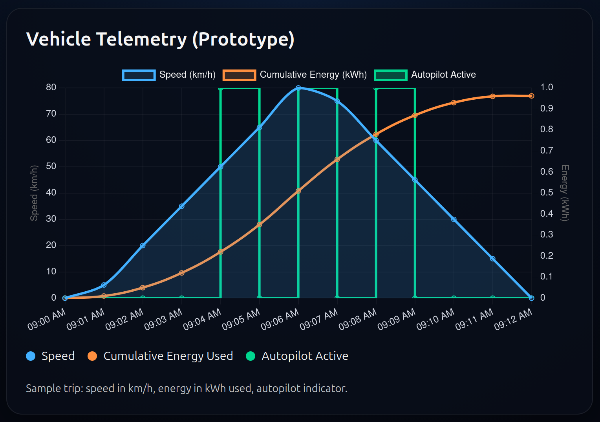
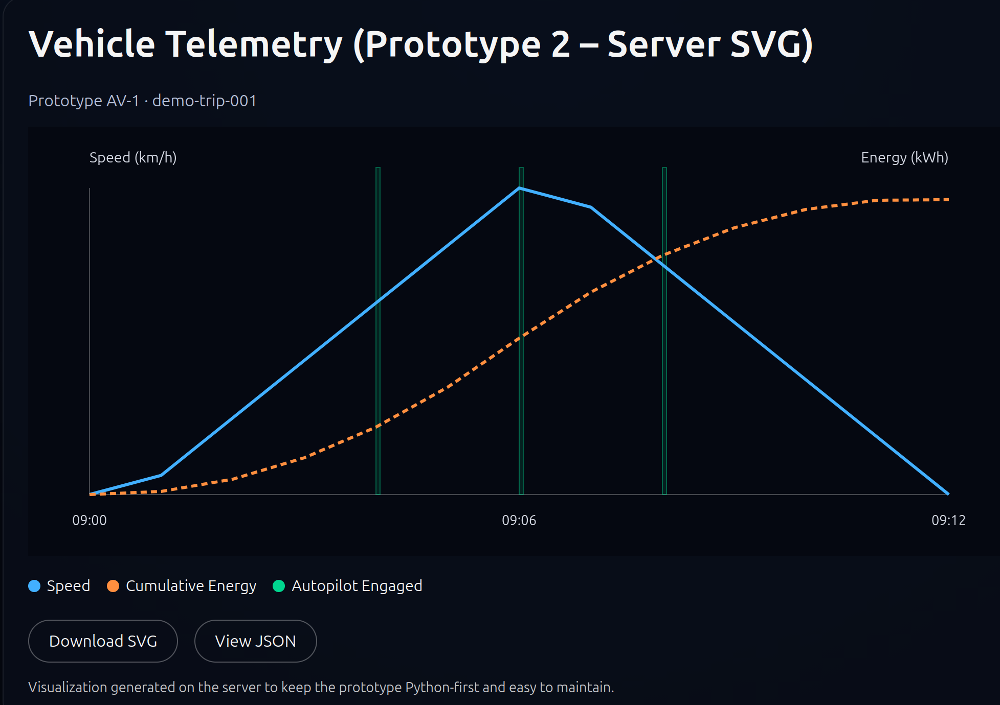

# python-telemetry-visualization
Prototype web based vehicle telemetry visualization using python

## Value statement

As a data analytics researcher for the vehicle driving automation domain, I would like to visualize vehicle telemetry data on my research laptop, and also be able to share the visualizations with others.

## Architectural considersations

Given that with the onset of artificial intelligence(AI) based software development, we want to create a solution that is a easy as possible for AI to maintain. The architecture of this application should be as simple as possible, and include the least amount of third party dependencies. 

We are going to go out on a limb and assume that Python is going to be the de facto standard language for LLM execute compute on, so LLMs will be best equiped to maintain the Python langage based applications.

As Linux is the foundation of server side compute, we will also assume that future development environment will be mostly Linux based, so the application shall be a Linux first and only solution. 

## Domain 

The domain is vehicle driving automation.

As a vehicle fleet manager, I would like to review the telemetry data on my vehicles after a vehicle has completed a trip.

The vehicle telemetry includes speed, gps, auto pilot, throttle position, brake, and energy usage data.

The telemetry visual commponent is devided into two groups, with group 1 containing vehicle control: auto pilot engagement, throttle position, brake positions. Group 2 containing speed and energy, with telemetry data values  displayed in a table. The telemetry data table component will display the values of the visualization at time t, which represents a specific time anywhere on the x-axis.

A playback head will indicate the current location of a trip replay on the graph.

## Visualization requirements

* The x-axis should represent time.
* The two telemetry groups should be drawn separately with group 1 being below group 2.
* The telemetry table component is located to the right of the group 1 and the group 2 components.
* The playback head shall be represented as a vertical line intersection the time axis.
* The auto pilot engagement should be represented as a horizontal bar below the control inputs.


## Prototype requirements

A web based appliction that shows a sample vehicle telemetry visualiztion for an hypothetical trip

The web applications allows the user to download the visualization as an image.

## Prototype 1 implementation

branch: prototype1

The initial version provides a single-file Python backend (`server.py`) plus a static HTML page that used Chart.js to render speed, energy usage, and autopilot data. Prototype 1 proved out the data model and API surface but still relied on a JavaScript charting library for visualization.



## Prototype 2 implementation

branch: prototype2

Prototype 2 keeps the lightweight Python backend but now renders the SVG entirely on the server. When the browser requests `/` it receives fully composed HTML with the inline SVG chart already embedded; the same SVG is also exposed at `/visualization.svg` so it can be downloaded or reused elsewhere. The visualization now follows the new domain requirements:

- **Group 2 (top)** – speed (km/h) and cumulative energy (kWh) sharing the same time axis.
- **Group 1 (bottom)** – autopilot engagement bands along with throttle and brake positions (%).
- The telemetry table now sits to the right of the visualization so the current sample values are visible without hiding the chart.

This keeps the visualization logic purely in Python (no Pyodide or JavaScript chart libraries). A “Download SVG” action on the page lets you grab the rendered visualization as an image directly from the server, and guarantees the two telemetry groups are rendered in their own dedicated panels.


    
### Prerequisites

- Python 3.9 or newer (only the Python standard library is required).

### Getting started

```bash
python3 server.py
```

Then open your browser to [http://127.0.0.1:7777](http://127.0.0.1:7777). Use the “Download SVG” button (or hit `/visualization.svg` directly) to save the visualization as an image.

### Inspecting time t

The SVG includes a playback head (vertical line) plus a telemetry table showing the values at time `t`. You can move `t` anywhere on the x-axis by providing query parameters:

- `?idx=N` – zero-based sample index (e.g. `/visualization.svg?idx=5`).
- `?time=YYYY-MM-DDTHH:MM` – ISO timestamp, the nearest sample is selected (e.g. `/?time=2024-05-01T09:06`).

Environment variables:

- `TELEMETRY_HOST` – host/interface to bind to (default `127.0.0.1`)
- `TELEMETRY_PORT` – port to listen on (default `7777`)

Kill the server with `Ctrl+C`. The `/telemetry` endpoint can also be queried directly to inspect the sample JSON payload.
